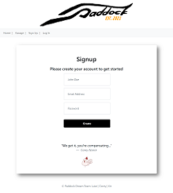
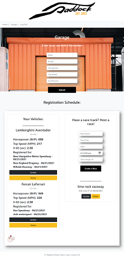

# Paddock

## Description

Paddock is an app that combines a robust back end--with servers, databases, advanced APIs, and user authentication—-to an intuitive front end. We used the MVC paradigm, created our own server-side API, and used Passport for authentication, and connect to a database.

## User Story

As a Racing Enthusiast, I want to be able to sign up to participate in races with my vehicle, add my vehicles to my garage with their specs, register my vehicles for a race, and see the races that I have signed my cars up for.

As a Track Owner, I want to be able to post track events. Once its posted, I would like to be able to manage my posting by editing and or deleting posted events.


## Acceptance Criteria

```md
WHEN I go to the page but am not authenticated,
THEN I am sent to the login page.
WHEN I log in
THEN I am directed to the homepage where I can view available races and sign my cars up for a race.
WHEN I go to my garage
THEN I can see the cars I have and the races they are signed up for
WHEN I go to my garage
THEN I can add cars to my garage
WHEN I add a car
THEN the car and specs are loaded to the web page
WHEN I create a race
THEN I can see the race details in my garage and it is available on the homepage for others to sign up for
WHEN I update a car or a race
THEN the updated details are populated to my garage and homepage.
WHEN I delete a car or race
THEN the car or race is removed from the garage an homepage
```


## Table

- [Installation](#installation)
- [Screenshots](#screenshots)
- [Deployment](#deployment)
- [Repository](#repository)
- [Credits](#credits)
- [Future Development](#future-development)
- [License](#license)


## Installation

Once pulled over from gitHub onto your local machine.
- First is to open up Microsoft Visual Studio Code.
    
- Then over on the side bar click ad folder to workspace
    
- Once you see on the files, to view in browser, right click index.html under workspace and then click Reveal in file explorer.
    
- Once the window comes up with the file. Just double click the file and the file will open up in the browser of your choice. 

- Run npm install for needed dependencies.

## Screenshots



<br>



<br>

## Deployment
#### Heroku app
https://shielded-tor-91530.herokuapp.com/login

## Repository
https://github.com/luketeal/projectAwesome


## Credits

https://bootcamp.unh.edu/ 
  
https://coding-boot-camp.github.io/full-stack/github/professional-readme-guide
  
https://choosealicense.com/

https://code.tutsplus.com/tutorials/using-passport-with-sequelize-and-mysql--cms-27537


(Node.js Passport Login System Tutorial)<br>https://youtu.be/-RCnNyD0L-s

https://www.freepik.com/
    


## Future Development

- Implement a results ranking system

- Implement a user message board

- Implement a forgot password

- Implement an Image uploader

- Implement indications to user based on database actions

- Implement functions to send emails to user's registered email.

## License

MIT License

Copyright (c)  2021  Luke Teal, Kit Long, Corey Nance

Permission is hereby granted, free of charge, to any person obtaining a copy
of this software and associated documentation files (the "Software"), to deal
in the Software without restriction, including without limitation the rights
to use, copy, modify, merge, publish, distribute, sublicense, and/or sell
copies of the Software, and to permit persons to whom the Software is
furnished to do so, subject to the following conditions:

The above copyright notice and this permission notice shall be included in all
copies or substantial portions of the Software.

THE SOFTWARE IS PROVIDED "AS IS", WITHOUT WARRANTY OF ANY KIND, EXPRESS OR
IMPLIED, INCLUDING BUT NOT LIMITED TO THE WARRANTIES OF MERCHANTABILITY,
FITNESS FOR A PARTICULAR PURPOSE AND NONINFRINGEMENT. IN NO EVENT SHALL THE
AUTHORS OR COPYRIGHT HOLDERS BE LIABLE FOR ANY CLAIM, DAMAGES OR OTHER
LIABILITY, WHETHER IN AN ACTION OF CONTRACT, TORT OR OTHERWISE, ARISING FROM,
OUT OF OR IN CONNECTION WITH THE SOFTWARE OR THE USE OR OTHER DEALINGS IN THE
SOFTWARE.


