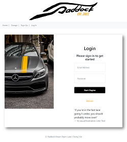

# projectAwesome

## Description

The tasks is to design and build an app that combines a robust back end--with servers, databases, advanced APIs, and user authentication—-to an intuitive front end. we were to use the MVC paradigm, create our own server-side API,  have user authentication, and connect to a database.

## User Story

As a Racing Enthusiast, I want to be able to sign up to participate in races with my vehicle, add my vehicles to my garage with their specs also be able to register for a race and see the races that I have signed my cars up for.  

As a Track Owner, I want to be able to post track events. Once its posted, I would like to be able to manage my posting by editing and or deleting posted events.

## Acceptance Criteria
(Need to update)

AS a RACING ENTHUSIAST, I want to be able to sign up to participate in races with my vehicle

AS a RACE TRACK OWNER, I want to be able to post events for my track
New
9:29

we wrote these last night which could be changed into acceptance criteria also:

AS a RACING ENTHUSIAST, I need to be able to add my vehicles to my garage with they’re specs

AS a RACING ENTHUSIAST, I need to be able to register for a race

AS a RACING ENTHUSIAST, I want to be able to see the races I’ve signed my cars for

Build a command-line application that at a minimum allows the user to:

  * Add departments, roles, employees

  * View departments, roles, employees

  * Update employee roles

## Table
(check for updating)
future and screen shot need work
- [Installation](#installation)
- [Screenshot](#screenshot)
- [Deployment](#deployment)
- [Repository](#repository)
- [Credits](#credits)
- [Future Development](#FutureDevelopment)
- [License](#license)

## Installation
(check for updating)
Once pulled over from gitHub onto your local machine.
- First is to open up Microsoft Visual Studio Code.
    
- Then over on the side bar click ad folder to workspace
    
- Once you see on the files, to view in browser, right click index.html under workspace and then click Reveal in file explorer.
    
- Once the window comes up with the file. Just double click the file and the file will open up in the browser of your choice. 

- Run npm install for needed dependencies.

(need to update)
## Screenshot
(need to update) need to add video

and video link

 

## Deployment
#### Heroku app
https://shielded-tor-91530.herokuapp.com/login

## Repository
https://github.com/luketeal/projectAwesome

## Credits
(check for updating) check for more credits to add

https://bootcamp.unh.edu/ 
  
https://coding-boot-camp.github.io/full-stack/github/professional-readme-guide
  
https://choosealicense.com/

https://code.tutsplus.com/tutorials/using-passport-with-sequelize-and-mysql--cms-27537

https://www.freepik.com/
    

## Future Development

- Implement a results ranking system

- Implement a user message board

- Implement a forgot password

- Implement an Image uploader

- Implement indications to user based on database actions

- Implement functions to send emails to user's registered email.

## License

MIT License

Copyright (c)  2021  Luke Teal, Kit Long, Corey Nance

Permission is hereby granted, free of charge, to any person obtaining a copy
of this software and associated documentation files (the "Software"), to deal
in the Software without restriction, including without limitation the rights
to use, copy, modify, merge, publish, distribute, sublicense, and/or sell
copies of the Software, and to permit persons to whom the Software is
furnished to do so, subject to the following conditions:

The above copyright notice and this permission notice shall be included in all
copies or substantial portions of the Software.

THE SOFTWARE IS PROVIDED "AS IS", WITHOUT WARRANTY OF ANY KIND, EXPRESS OR
IMPLIED, INCLUDING BUT NOT LIMITED TO THE WARRANTIES OF MERCHANTABILITY,
FITNESS FOR A PARTICULAR PURPOSE AND NONINFRINGEMENT. IN NO EVENT SHALL THE
AUTHORS OR COPYRIGHT HOLDERS BE LIABLE FOR ANY CLAIM, DAMAGES OR OTHER
LIABILITY, WHETHER IN AN ACTION OF CONTRACT, TORT OR OTHERWISE, ARISING FROM,
OUT OF OR IN CONNECTION WITH THE SOFTWARE OR THE USE OR OTHER DEALINGS IN THE
SOFTWARE.

# Unit 15: Project 2

## Overview

 

## Key Topics

The following topics will be covered in this unit:

* Full-stack applications

* [Git branching workflow](https://git-scm.com/book/en/v2/Git-Branching-Branching-Workflows)

* [Agile software development](https://en.wikipedia.org/wiki/Agile_software_development)

* Collaborative development

## Learning Objectives

You will be employer-ready if you are able to:

* Speak technically about a feature you implemented in your project

* Explain and execute git branching workflow in a collaborative project

* Resolve merge conflicts

* Explain agile software development

* Design, build and deploy a full-stack web application to Heroku

* Prepare a professional presentation and repository README for your project

## Homework

## Resources

